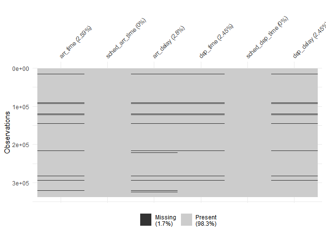
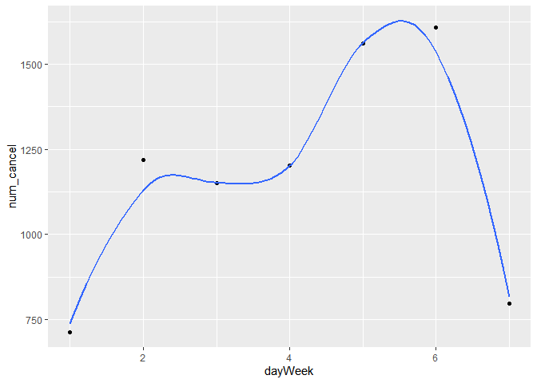
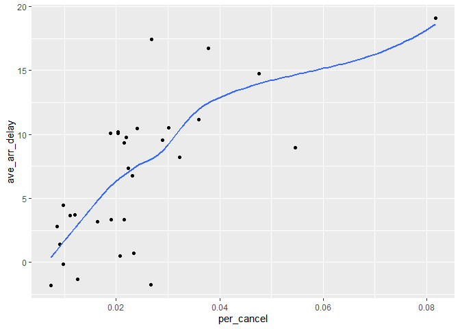
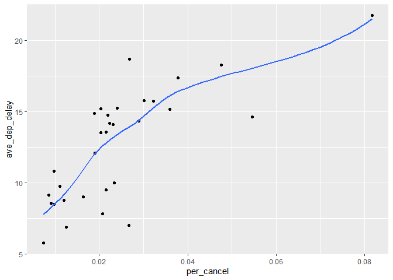

STAT433 Assignment 2
================
Yuhan Wang
2021-02-12

## load require package

``` r
library(dplyr)
```

    ## 
    ## Attaching package: 'dplyr'

    ## The following objects are masked from 'package:stats':
    ## 
    ##     filter, lag

    ## The following objects are masked from 'package:base':
    ## 
    ##     intersect, setdiff, setequal, union

``` r
# install.packages("nycflights13")
library(nycflights13)
library(ggplot2)
library(naniar)
library(lubridate) 
```

    ## 
    ## Attaching package: 'lubridate'

    ## The following objects are masked from 'package:base':
    ## 
    ##     date, intersect, setdiff, union

# 1) How many flights have a missing dep\_time? What other variables are missing? What might these rows represent?

``` r
#count the total number of missing dep_time
sum(is.na(flights$dep_time))
```

    ## [1] 8255

``` r
#view the pattern of missing value
vis_miss(flights %>% select(contains("arr_") , contains("dep_")),warn_large_data=FALSE)
```

<!-- -->

**We notice that all rows that missing dep\_time also missing
dep\_delay, arr\_time and arr\_delay, then we infer that they are
cancelled flights.**

# 2) Currently dep\_time and sched\_dep\_time are convenient to look at, but hard to compute with because they are not really continuous numbers. Convert them to a more convenient representation of number of minutes since midnight.

``` r
#Convert select columns to minutes since midnight
flights_new <- flights %>% mutate(dep_time_MM = dep_time %/% 100 * 60 + dep_time %% 100,
                                  sched_dep_time_MM = sched_dep_time %/% 100 * 60 + sched_dep_time %% 100)
#Show the result
flights_new %>% select(contains("dep_time"))
```

    ## # A tibble: 336,776 x 4
    ##    dep_time sched_dep_time dep_time_MM sched_dep_time_MM
    ##       <int>          <int>       <dbl>             <dbl>
    ##  1      517            515         317               315
    ##  2      533            529         333               329
    ##  3      542            540         342               340
    ##  4      544            545         344               345
    ##  5      554            600         354               360
    ##  6      554            558         354               358
    ##  7      555            600         355               360
    ##  8      557            600         357               360
    ##  9      557            600         357               360
    ## 10      558            600         358               360
    ## # ... with 336,766 more rows

# 3) Look at the number of cancelled flights per day. Is there a pattern? Is the proportion of cancelled flights related to the average delay? Use multiple dyplr operations, all on one line, concluding with \`ggplot(aes(x= ,y=)) + geom\_point()’

``` r
# look at the number of cancelled flights across weekday
flights_new <-  flights_new %>% 
  mutate(departure = make_datetime(year, month, day, hour, minute)) 

flights_new %>% mutate(dayWeek = wday(departure)) %>% group_by(dayWeek) %>% 
  summarise(num_cancel = sum(is.na(dep_time))) %>% 
  ggplot(aes(x=dayWeek,y=num_cancel)) +
  geom_point() + geom_smooth(se = FALSE)
```

    ## `geom_smooth()` using method = 'loess' and formula 'y ~ x'

<!-- -->

**We can see the number of canceled flights is higher for weekdays
compared with weekends.**

``` r
#View(flights %>% filter(is.na(dep_time)))

flights %>% group_by(day) %>% 
  summarise(per_cancel = sum(is.na(dep_time))/n(),
            ave_arr_delay = mean(arr_delay,na.rm = T)) %>% 
  ggplot(aes(x=per_cancel,y=ave_arr_delay)) +
  geom_point() + geom_smooth(se = FALSE)
```

    ## `geom_smooth()` using method = 'loess' and formula 'y ~ x'

<!-- -->

``` r
flights %>% group_by(day) %>% 
  summarise(per_cancel = sum(is.na(dep_time))/n(),
            ave_dep_delay = mean(dep_delay,na.rm = T)) %>% 
  ggplot(aes(x=per_cancel,y=ave_dep_delay)) +
  geom_point() + geom_smooth(se = FALSE)
```

    ## `geom_smooth()` using method = 'loess' and formula 'y ~ x'

<!-- -->

**We can see the proportion of canceled flights is positively related to
the average delay.**
